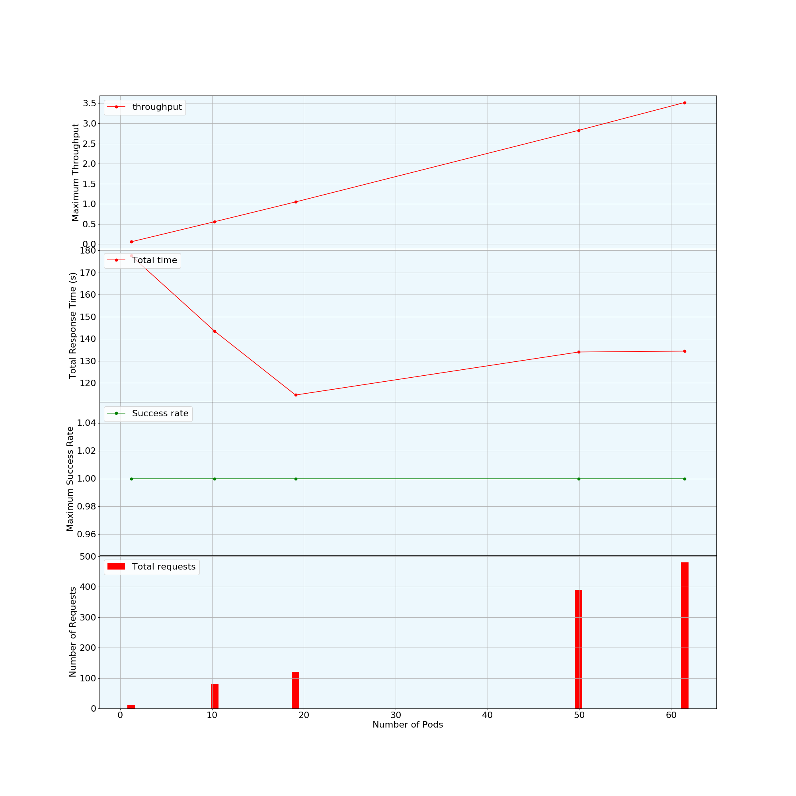
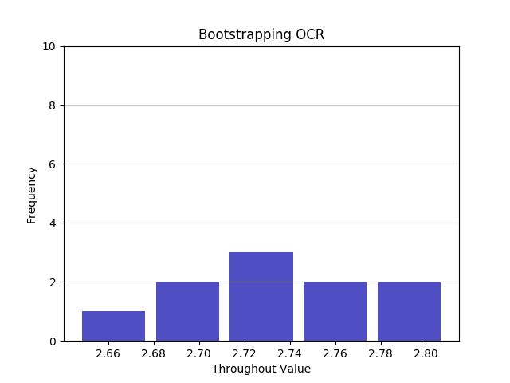

# Testing Methodology

This document explains the testing methodology to find the optimal number of instances of a cloud application for given SLAs.
The main steps are:
1. Distributed performance testing and resource usage monitoring.
2. Analyzing the results of performance testing to calculate throughput and success-rate.
3. Analyzing the resource profile to identify if the application is CPU- bound or I/O- bound.
4. Recommending the number of instances for given SLAs and further verification tests for the recommendation.
5. Bootstrapping to render confidence on the recommended number of instances.

**Please download all the files in the same folder.**
**Update locust_async.py for access tokens**


## Distributed Performance Testing

### Testing Setup (Configuring deployment files in kubernetes_config folder)

**locust-async-master-controller.yaml, locust-async-worker-controller.yaml:**

* This is the master and slave controller which are deployed as a replication controller.
* You need to edit the CLIENT_ID, CLIENT_SECRET, XSUAA_URL, other fields specific related to host endpoint and the fields below:

| Name | Description | Default value |
| --- | --- | --- |
| NUMBER_SLAVES | number of slaves| 10 |
| NUM_THREADS_FROM | Number of users |  |
| NUM_REQUEST | number of requests |  |
| MIN_WAIT | Random wait time between min and max before the next request | 0 |
| MAX_WAIT | Random wait time between min and max before the next request | 0 |

### Note:
**These both files have to be editted every time you send a new number of requests. _This can't be automatically done by the methodology._**
Each NUM_THREADS_FROM (users) will send NUM_REQUEST requests.
So, the total requests that will be executed are NUM_THREADS_FROM * NUM_REQUEST.
Master divides the NUM_THREADS_FROM (users) by itself among the slaves.
For example, to send 300 requests do the following:
1. Divide 300 among NUM_THREADS_FROM and NUM_REQUESTS. 
Let's say, 1 and 300 repectively (1 user, 300 requests) or 10 and 30 repectively (10 users, 30 requests each), etc.
2. You can either deploy the three files - master controller, worker controller and master service manually or make use of the methodology below.

### wrapper_locust.py

**_Update the query links to prometheus before execution in function monitor()_**

The application has to be tested with a set of its fixed instances. This set contains a fixed number of instances of the application and the methodology proposes a grid search approach to fill this set.

* The set is: {1, 10, 20}. So, the methodology will first gather output from 1 instance, then 10 instances and then 20 instances.
* Each test with the specific number of instance will last within 2 to 4 minutes (The user can modify this min and max time).
* Each test will send specific number of requests within the timeframe (The user can modify the number of requests).
* The user will be recommended a test plan (specific number of requests) for each number of instances in the set.

The following parameters need to be considered in order to run a specific test:

| Name | Description | Default value |
| --- | --- | --- |
| requests | number of requests| |
| ftest | Do you want a test plan for the set of instances? | n |
| mint | minimum time for the test | 2 |
| maxt | maximum time for the test | 4 |
| boot | Do you want to conduct bootstrapping? | n |


If you don't want a test plan, you can execute the following for 300 requests (considering you have already done the changes as mentioned in above example for 300 requests):

```
python3 wrapper_locust.py --requests 300
```

If you want the framework to recommend you a test plan for the set of instances follow the steps:
1. Fix the running number of instances as 1 and send 20 requests via the following command (edit 20 requests in master, worker controller first):

```
python3 wrapper_locust.py --requests 20 --ftest y
```

* The framework will check how much time 1 instance took to execute 20 requests.
* It will then calculate how many requests can fit in mint and maxt and display it.
* If 20 requests itself fit, then a test plan is displayed for 1, 10, 20 instances.
2. Else another number of requests are displayed and you have to again execute it with 1 instance to verify if this new number fits.
* If this new number of requests fit, a test plan is displayed else the loop continues.

If 5 requests fit in the timeframe. The test plan looks like this:

```
"First test looks good. The following testing pattern is recommended:"

"1 pod -----> 5 requests"
"1 pod -----> 10 requests" 

"10 pods -----> 50 requests"
"10 pods -----> 80 requests"

"20 pods -----> 80 requests")
"20 pods -----> 120 requests")
```
Fix the number of instances as specified, edit the deployment files for number of requests and execute using wrapper_locust.py

### Note:
The test plan contains two different number of requests for each number of instance in the set. The goal of these requests is to make sure that the instances are consuming the resources to the peak value (MAX THROUGHPUT). The first number of requests are high enough to give maximum throughput and second number requests to the same number of instances verify it.

* After the test all the data are saved in their respective folders automatically.
* The folders' names will be 1_pod, 10_pod, 20_pod.
* Each folder will have 2 files named with the number of requests sent to them. These files has the performance tests results.
* Each folder also have a folder named 'resource', which has results of resource profile during the tests.


## Analyses of results and recommendation of instances

### analysis.py

The following parameters need to be considered for analysis of the results and get a recommended number of instances for a SLA:

| Name | Description | Default value |
| --- | --- | --- |
| cpu | Number of cpu allocated to each instance | |
| mem | Amount of memory allocated to each insance (GB) | |
| thr | Desired throughput (SLA) | |
| sr | Desired success rate (SLA) | |
| accu | Desired accuracy | 95 |
| totime | Desired total time of the experiment (sec) | 1500 |

### Explanation:

**1. accu (Accuracy)** - The data from the set of instances are fit in a polynomial model, and then it calculates the number of instances required for the SLA. To verify this, tests are conducted with the recommended number of instances and if its throughput is equal to the throughput specified in the SLA, it’s a success. Else the test results from the calculated number of instances along with the original set are fit in the model again to have a better fit. After this better fit, the framework again calculates another number of instances. The difference between previously recommended instances and the new one is accuracy.

**2. totime (Total Time)** - The user can also input the desired total time until which he needs the number of instances that fulfils the SLA. If the time is too less, the accuracy may not be reached.

In case, the allocated CPU is 1, memory is 1 GB, the desired throughput is 2.7, the desired success rate is 0.9, the following command will give the number of instances required to handle the given SLA:

```
python3 analysis.py --cpu 1 --mem 1 --thr 2.7 --sr 0.9
```

* The framework calculates the throughput and success rate for all the instances in the set. For this, it utilizes the performance test results.
* Then, it checks the resource profile of the application by utilizing the resource usage data. 
* It then fit the data in a polynomial model and recommends instances with verification tests.

**_The framework generates a file, 'data.txt' to store data related to specific SLA. If you want to change SLA, delete this file and run tests._**

### Verification tests

The framework recommends a number of instances for given SLA and also a test plan to verify the same:

```
Analysis start!!

Its a CPU intensive application for 1.0 pods
Its a CPU intensive application for 10.0 pods
Its a CPU intensive application for 20.0 pods
The recommended number pods for your SLA is: 62
The following verification test may be conducted:
62 pods -----> 750 requests
62 pods -----> 1125 requests
```

* Like here for example, you can run the wrapper_locust.py with 62 instances and given number of requests.
* Then again execute analysis.py (as above) which will automatically fit data from 1, 10, 20, 62 instances.

There are 2 cases possible now:
1. The already recommended number of instances have satisfied the SLA with the desired accuracy and the analysis is stopped.
2. Or, a new recommendation with a test plan is displayed.
* In case 2, another verification tests with given instances and requests have to be conducted.

**At the end, a graph is generated. Below is the result of OCR service with 49 instances as final recommendation:**



**First, 62 instances are recommended and after verfication 49 instances. When 49 instances are verified the accuracy is met.**

## Bootstrapping

The cloud environment has an uncertainty factor due to multi-tenancy and VM scheduling. This causes variation in the results (calculated throughput, success-rate). To render confidence on the final recommended number of instances a statistical approach called bootstrapping is executed:
* With the final recommended number of instances, multiple performance tests are done to gather multiple values of throughput.
* You can use the same number of requests as already recommended by the framework.
* For example, bootstrapping with 49 OCR instances is started via following:

```
python3 wrapper_locust.py --requests 260 --boot y
python3 wrapper_locust.py --requests 390 --boot y
```
This will calculate one throughput and the above commands can be repeated n times to receive n throughputs. 
This is a range of the throughputs 49 instances can provide and we need an avergae estimation.

Bootstrapping starts with resampling a data-set or population (in our case n throughputs) into multiple simulated samples of same size. 
The following steps are used to create a bootstrap sample:
1. Choose the size of a bootstrap sample. Normally it’s equal to the size of the population but the user can fit it according to his needs.
2. Randomly select data from the population with replacement until the size of the bootstrap sample.

You can repeat the above steps and create as many samples. At the end, each samples' average is calculated which is again a range of throughput's average.
Using this range of averages, the population's average can be estimated with a confidence interval (CI).
All the steps are automatically executed by above commands while bootstrapping.

**Bootstrapping result of OCR service**



* 49 instances are tested 5 times and 5 varying throughput are calculated from the tests.
* I collected 10 bootstrap samples with a size of 5 each.
* The 90% CI of throughput that can be expected from 49 running instances of OCR with 90% confidence level is between 2.67 to 2.79.
